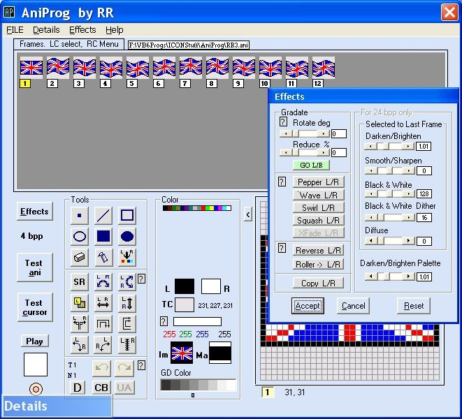



## Create/Edit Animated Cursors \(3 Oct\)

### Description

Create/Edit Animated Cursors by Robert Rayment. As well as drawing the frames of an animated cursor, provides a set of step changes across the frames or a selected area for peppering, waving, swirling, squashing & Xfading. Frames can also be step changed for rotation and reduction. So this prog automates some kinds of animation. 1,4,8 & 24 bpp images can be handled. Some effects are included for 24 bpp images. Images can be loaded from ani, cur or ico files as well as captured from a bmp, gif or jpg. Title, author, number of frames, HotX & HotY and frame rates can be changed. For a new cursor any of the bpps can be selected. Some example ani-files are included. Cursors can be tested and saved at any stage. Please read the help for limitations. (Tested on Win98 & WinXP, Zip 82KB) (3 Oct Calc duration in frmDetails, system cursor preserved).
 
### More Info
 
Can be ani,cur etc

Just run, read Help

ani-cursors

             |
---                |---
**Submitted On**   |2004-09-24 16:08:44
**By**             |[Robert Rayment](https://github.com/Planet-Source-Code/PSCIndex/blob/master/ByAuthor/robert-rayment.md)
**Level**          |Intermediate
**User Rating**    |5.0 (134 globes from 27 users)
**Compatibility**  |VB 6\.0
**Category**       |[Complete Applications](https://github.com/Planet-Source-Code/PSCIndex/blob/master/ByCategory/complete-applications__1-27.md)
**World**          |[Visual Basic](https://github.com/Planet-Source-Code/PSCIndex/blob/master/ByWorld/visual-basic.md)
**Archive File**   |[Create\_Edi1799951032004\.zip](https://github.com/Planet-Source-Code/robert-rayment-create-edit-animated-cursors-3-oct__1-55987/archive/master.zip)

### API Declarations

See code

